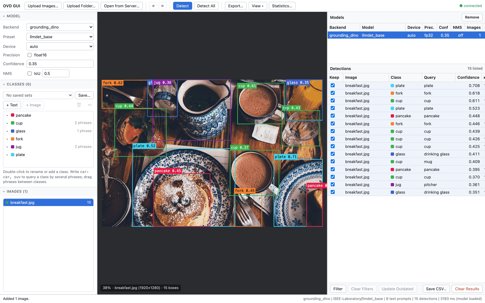

# OVD-GUI



## Overview

Web GUI for [OpenVocabularyDetector](https://github.com/ry-yoshida-dev/OpenVocabularyDetector), with a PySide6
desktop window as an alternative. Open images, type the classes to detect, pick a model, and see boxes and a
detection table.

- **Web interface by default**: `ovd-gui` starts a server on `127.0.0.1:8000` and opens it in the default browser.
  The server runs the models, so it can be a GPU machine reached over SSH (`ssh -L 8000:localhost:8000 host`, then
  open the printed `http://localhost:8000/?token=…` locally). The printed address carries an access token created
  for each run; other pages and other browsers cannot use the server. `--qt` starts the desktop window instead.
- **Images from the browser or the server**: images and folders dropped on the page (or chosen with
  `Upload Images…` / `Upload Folder…`) are uploaded into `ovd_gui_data/uploads/`, keeping their folder structure; uploading the same
  content again reuses the stored copy and its results, while a different file of the same name gets a numbered name.
  `Open from Server…` browses the file system of the server and opens images in place.

- **Models are switched by preset**: every YAML preset shipped in `open_vocabulary_detector/config/` is listed by
  backend (Grounding DINO, OWL-ViT, YOLO-World, YOLOE) and built into `DetectorSettings` with
  [DataclassInitializer](https://github.com/ry-yoshida-dev/DataclassInitializer).
- **Overrides without editing YAML**: device, float16, confidence and NMS thresholds can be changed per run.
- **Loaded model is reused**: changing only thresholds does not reload the model; changing the preset, device or
  precision does.
- **Classes are queried by several phrases**: `car: car, suv, taxi` detects cars with any of the phrases and reports
  them as `car`; the detection table shows which phrase matched. A class written without a colon is prompted by its
  name.
- **Image prompts**: with OWL-ViT or YOLOE, example images can be added to a class, separately from the images to
  analyze; examples are boxed in a dialog, or the whole image is used. Each reference image becomes one more prompt
  of the class, next to its phrases. With a model that takes phrases only, classes that have reference images but no
  phrase are listed in a confirmation and, once accepted, left out of the run.
- **Open images are detected in the background**: every open image without an up-to-date result for the current
  model is detected one by one in the background, the shown image first, without blocking the interface. Your own
  actions come first: `Detect`, `Detect All` and export start right after the image being inferred, a newly shown
  image is detected before the others, and an image opened during `Detect All` is detected next. A failed
  background detection pauses the others until you open, show or detect images or edit the classes.
- **Search across images**: `Detect All` detects every open image; the detection table lists the current image or
  all images with the image name, filters any column from the `Filter` button below it or by right-clicking its
  header (checked values for image, class and query; bounds for confidence and box corners) and sorts by any column.
  Each image keeps its latest result, so revisiting it shows its boxes without detecting again.
- **Compare models without detecting again**: results are kept per model and options (device, precision,
  thresholds). Detecting with another preset adds a row to the `Models` table above the detection table instead of
  replacing earlier results; selecting a row there switches the boxes and the detection table to that model's
  results.
- **Edit classes without losing results**: adding, removing or rewording a class keeps every result. Images detected
  with other classes are marked with a warning icon in the detection table (its tool tip names the added, removed or
  edited classes) and counted under `Outdated` in the `Models` table; they are detected again in the
  background, the shown image first, and `Update Outdated` detects them all at once.
- **Results are remembered**: results of every model, with the rejected detections, are saved to
  `ovd_gui_data/results.ovdresults` shortly after each change and restored at the next start for image files that
  have not changed; opening the same images again shows them without detecting. The class minimums are kept in
  `ovd_gui_data/class_thresholds.json`.
- **Open images are remembered**: the open images and the shown one are kept in `ovd_gui_data/session.json` and
  opened again at the next start without command-line arguments; files that no longer exist are skipped.
- **Image list status**: each open image shows whether it is detected, outdated, failed or not analyzed with the
  shown model, and how many of its detections are kept.
- **Review detections**: unchecking `Keep` in the detection table rejects a detection (Space toggles the selected
  one; the right-click menu keeps or rejects every listed one, e.g. after filtering low confidences). The image draws
  only the detections the table lists, so its column filters also filter the boxes, and rejected boxes are dashed.
- **Minimum confidence per class**: set in the statistics panel on top of the detector threshold; detections below
  it are hidden from the table and the image and left out of exports, without detecting again.
- **Statistics and model comparison**: `Statistics…` counts the detections of each class over the open images with a
  confidence histogram, and compares the shown model with another stored one class by class (detections paired by
  box overlap); the compared model's boxes are drawn dotted over the image.
- **Export to annotation formats**: the stored results of the shown model are saved as MS COCO, YOLO, Pascal VOC,
  LabelMe or Create ML with [ObjectDetectionFormat](https://github.com/ry-yoshida-dev/ObjectDetectionFormat),
  leaving out rejected detections and those below the class minimums, optionally also those hidden by the table
  filters or below an export minimum. Open images without an up-to-date result are detected first. Optionally, a
  copy of every exported image with its exported boxes drawn is saved in `annotated_images/` of the output directory.
  Files are written on the server (by default under `exports/<timestamp>/` of the working directory); in the web
  interface, `Download last export` in the status bar fetches the last export as a ZIP file.
- **Detection table as CSV**: `Save CSV…` below the detection table (or its right-click menu) saves the listed
  detections in display order with image path, class, prompt, confidence, box corners and whether each is kept.
- **Classes are remembered**: the classes and their phrases are kept in `ovd_gui_data/` under the working directory
  and restored at the next start.
- **Class sets keep image prompts**: a named class set is saved as one self-contained archive,
  `ovd_gui_data/classes/<name>.ovdset`, holding the classes, their phrases, the reference boxes and the pixels of
  every reference image, so loading it restores the image prompts even when the original image files are moved or
  gone, and the file can be copied to another machine. Plain class lists (`name` or `name: phrase, phrase` per line,
  compatible with YOLO `classes.txt` and Darknet `.names`) can still be loaded from a file.
- **Interface stays responsive**: loading and inference run on a worker thread; the web server pushes every change
  to the connected browsers over a WebSocket.

Weights are downloaded on first use; Ultralytics weights are saved to the current
working directory. Nothing is written to OS-level settings; application data stays in `ovd_gui_data/`.

## Installation

```bash
pip install -e .          # web interface
pip install -e ".[qt]"    # also the PySide6 desktop window (ovd-gui --qt)
pip install -e ".[dev]"   # development tools, tests and PySide6
```

The web interface is a Vite + React + TypeScript app in [frontend/](frontend/), built into `src/ovd_gui/web/static/`
(not committed), which the server serves; without it, the server answers with a page explaining how to build it.
Build it once after cloning and after every change to the frontend (Node.js 22):

```bash
cd frontend
npm install
npm run build
```

While working on the frontend, `npm run dev` starts the Vite dev server with hot reload and proxies `/api` (including
the WebSocket) to `127.0.0.1:8000`, so run `ovd-gui --no-browser` next to it; set `OVD_GUI_BACKEND` to proxy
elsewhere. Open the printed `http://127.0.0.1:8000/?token=…` once first: the access cookie it sets is shared by
every port of `127.0.0.1`, so the dev server on `http://127.0.0.1:5173` can use the API.

For local development against sibling checkouts:

```bash
pip install -e ../OpenVocabularyDetector -e ../DataclassInitializer -e ../ObjectDetectionFormat -e ".[dev]"
```

## Development

```bash
uv sync --extra dev
uv run ruff check src tests
uv run ruff format --check src tests
uv run mypy src tests
uv run basedpyright
QT_QPA_PLATFORM=offscreen uv run pytest
(cd frontend && npm ci && npm run build)
```

The same checks run on every push and pull request in [GitHub Actions](.github/workflows/ci.yml). Git dependencies
are pinned to commits in `pyproject.toml`; update the commit there and run `uv lock` to upgrade one.

## Examples

```bash
ovd-gui                            # web server on http://127.0.0.1:8000, opened in the default browser
ovd-gui path/to/images/ photo.jpg  # without arguments, the images open at the last close are opened again
ovd-gui --port 8080 --no-browser   # e.g. on a remote machine
ovd-gui --host 0.0.0.0             # reachable from the network (plain HTTP token; prefer SSH forwarding)
ovd-gui --qt                       # PySide6 desktop window; needs pip install -e ".[qt]"
python -m ovd_gui
```

On a remote machine, run `ovd-gui --no-browser` there and forward the port from your computer:

```bash
ssh -L 8000:localhost:8000 host
```

### Web interface

| Action | How |
| ------ | --- |
| Open images | Drop files or folders on the page or use `Upload Images…` / `Upload Folder…` to upload them from this computer; `Open from Server…` (Ctrl+O) browses the server and opens images in place; or pass them as command-line arguments |
| Edit classes | `+ Text` adds a class, or a phrase next to the selected phrase; double-click to rename; drag phrases and reference images between classes; `Edit Classes as Text` replaces every class at once (`name` or `name: phrase, phrase` per line) |
| Class sets | `Class Sets` lists, loads, renames, deletes, imports and exports the sets saved in `ovd_gui_data/classes/` |
| Add an image prompt | Select a class, press `+ Image`, choose example images (upload or `From Server…`), then drag boxes around the examples or press `Use Whole Image` |
| Detect | Open images (detected in the background), `Detect` (Ctrl+Enter), `Detect All` (Ctrl+Shift+Enter) or `Update Outdated` |
| Compare models | Change the model and detect again; select a row of the model table to switch results; `Statistics…` (Ctrl+I) compares with another model |
| Review | Click a column header to sort; right-click it or use `Filter` below the table to filter; uncheck `Keep` (or press Space) to reject a detection |
| Browse images | ← / → or the arrows in the toolbar |
| Export | `Export…` (Ctrl+E) writes on the server; `Download last export` in the status bar downloads it as a ZIP file; `Save CSV…` saves the listed detections |

### Desktop window (`--qt`)

| Action | How |
| ------ | --- |
| Open images | Drop files or folders anywhere on the window, `Open Images…` / `Open Folder…`, or command-line arguments |
| Add a class or phrase | `+ Text` above the class tree adds a row next to the selection at the same level: a class after a selected class, a phrase after a selected phrase, a class at the end when nothing is selected (double-clicking the empty area also adds a class). Type the name and press Enter; Escape cancels. `suv, taxi` adds two phrases, and `car: car, suv` names the phrases of a new class |
| Move a prompt | Drag a phrase onto another class or between its phrases to move it there; drop it between classes or below the rows to make it a class of its own. Reference images can be dragged to another class |
| Edit or remove | Double-click a class or phrase to edit it; the trash button or Delete removes the selected classes, phrases or reference images; the same actions are in the right-click menu |
| Save / load classes | The `Set` drop-down above the class tree lists the class sets saved in `ovd_gui_data/classes/`; choosing one loads it (asking first whenever unsaved classes would be discarded; `Edited` marks edits since the set was loaded or saved). `Save…` next to it asks only for a set name and saves the classes with their phrases and reference images. The three-dot menu › `Open File…` takes an `.ovdset` archive or a class list text file from elsewhere |
| Manage class sets | Three-dot menu › `Class Sets…` opens the library: search sets and classes, preview the classes and image prompts of a set, `Load` (or double-click) to replace the current classes, rename in place (F2), delete with confirmation (Delete or the trash button), `Import…` / `Export…` `.ovdset` files |
| Add an image prompt | Select a class, press `+ Image`, drop example images or folders onto the window (or use `Open Images…` / `Open Folder…`), then drag boxes around the examples or press `Use Whole Image`; each image appears under the class as one prompt |
| Detect | Open an image (every image is detected in the background when it has no result yet), or `Detect` / Ctrl+Enter to detect it again |
| Detect every image | `Detect All` or Ctrl+Shift+Enter (cancellable); every image fills in the table as it is detected |
| Find images showing a class | `Filter` › `Class` below the table (or right-click the `Class` header) and check the classes; click a column header to sort, e.g. by `Confidence` |
| Jump to a detection | Select its row; its image opens and the box is highlighted |
| Compare models | Detect with one preset, change the preset (or thresholds) and detect again; select a row of the `Models` table to switch between their results |
| Refresh after editing classes | `Update Outdated` below the table detects again only the images marked outdated |
| Forget results | `Remove` above the `Models` table (or Delete) forgets the selected model; `Clear Results` below the table forgets every model |
| Fold panels | Click a sidebar section header |
| Zoom | Mouse wheel; double-click fits the image again |
| Browse images | ◀ / ▶ in the toolbar, or Left / Right (Page Up / Page Down) on the image or the image list |
| Close images | Select them in the image list and press Delete or use the right-click menu; their results are kept |
| Keep or reject detections | Check or uncheck `Keep` in the detection table, press Space on a row, or right-click › `Keep All Listed` / `Reject All Listed` |
| Change how boxes are drawn | `View` in the toolbar: labels, confidences, rejected boxes, compared model, line width, fill |
| Set class minimums | `Statistics…` (Ctrl+I): the default minimum and the `Min. Confidence` column; the histogram marks the minimum of the selected class |
| Compare with another model | `Statistics…` › `Compare With`: per-class counts, and the compared boxes drawn dotted on the image |
| Export results | `Export…` or Ctrl+E; choose the format, output directory, exported detections and minimum confidence, and whether images with boxes drawn are saved too; images without an up-to-date result are detected first (cancellable) |
| Save the table | `Save CSV…` below the detection table, or right-click › `Save Listed as CSV…`; only the listed rows are saved, in display order |
